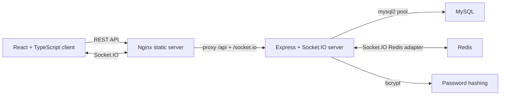

# ChatSphere


ChatSphere is a production-minded full-stack realtime chat application. It combines a typed React frontend, multi-channel chat, an Express + Socket.IO backend, MySQL persistence, Redis-backed realtime scaling, secure session authentication, and Dockerized delivery.

## Why This Project

I built ChatSphere to go beyond a basic chat demo and practice the engineering concerns that show up in production systems: authenticated realtime connections, persistent state, bounded history loading, failure-aware message sending, API tests, containerized services, and horizontal scaling paths.

The current version is designed to run as a multi-service Docker application:

- React + TypeScript frontend served as static production assets through Nginx
- Channel-based chat UI with isolated message history and online-user lists
- Express REST API and Socket.IO backend
- MySQL for users, sessions, and messages
- Redis for Socket.IO cross-instance broadcasts and online-user discovery

## Architecture



ChatSphere uses REST endpoints for authentication, session checks, paginated message loading, and user loading. Socket.IO connections are authenticated against the same server-side session cookie before realtime events are accepted. Messages are persisted in MySQL. Redis backs the Socket.IO adapter so broadcasts and online-user discovery can work across multiple server instances.

## Engineering Highlights

- **Typed frontend:** React components and API clients are written in TypeScript with shared response/error types.
- **Secure auth:** Passwords are hashed with bcrypt; sessions use HttpOnly, SameSite, Max-Age, and production Secure cookie settings.
- **Authenticated sockets:** Socket.IO identity comes from the session cookie, not a client-provided username.
- **Channels:** `General`, `Engineering`, and `Random` channels isolate message history and online-user presence.
- **Reliable sends:** Message sends use Socket.IO acknowledgements so the UI can show sending, failed, and retry states.
- **Scalable realtime:** Redis adapter enables cross-instance Socket.IO broadcasts and online-user discovery.
- **Bounded history:** Message history is paginated with an `id < before` cursor instead of loading full chat history.
- **Abuse protection:** Login and registration routes are rate limited.
- **Test coverage:** Backend tests cover validation helpers, protected routes, session behavior, registration cookies, pagination query handling, and rate limiting.
- **Production container:** The frontend is built once and served from Nginx, with `/api` and `/socket.io` proxied to the backend.

## Tech Stack

| Area | Tools |
|------|-------|
| Frontend | React, TypeScript, Vite, Socket.IO Client |
| Backend | Node.js, Express, Socket.IO, bcrypt, cookie-parser |
| Data | MySQL 8, Redis 7 |
| Delivery | Docker, Docker Compose, Nginx |
| Testing | Node test runner, Supertest, ESLint, TypeScript |

## API Overview

| Method | Endpoint | Purpose |
|--------|----------|---------|
| `GET` | `/api/session` | Check whether the current browser has a valid session |
| `GET` | `/api/channels` | Load available chat channels |
| `POST` | `/api/auth/register` | Create a user, hash the password, and start a session |
| `POST` | `/api/auth/login` | Verify credentials and start a session |
| `DELETE` | `/api/session` | Clear the session cookie and delete the stored session |
| `GET` | `/api/messages?channel=<id>&before=<id>&limit=50` | Load a bounded page of channel messages |
| `GET` | `/api/users?channel=<id>` | Load users currently connected to a channel |

## Realtime Events

| Event | Direction | Purpose |
|-------|-----------|---------|
| `join-channel` | Client to server | Move the socket into a channel room |
| `send-message` | Client to server | Persist a message and return an acknowledgement |
| `messages-updated` | Server to clients | Broadcast the latest message page |
| `users-updated` | Server to clients | Broadcast the active user list |
| `chat-error` | Server to client | Report message or server errors |

## Scaling Considerations

The app is currently suitable for single-node deployment and has a clear path to multi-instance realtime scaling:

- Redis adapter lets Socket.IO broadcasts fan out across backend instances.
- Socket.IO rooms isolate channel broadcasts and channel-specific online-user discovery.
- `io.in(channelRoom).fetchSockets()` is used for online-user discovery, so channel presence can span Redis-connected Socket.IO nodes.
- MySQL stores durable users, sessions, and messages.
- Message pagination avoids repeatedly loading unbounded history.

Future production work would include a Redis-backed session store, Redis-backed rate limiting, room-based message partitioning with `(room_id, id)` indexes, and a load balancer configured for websocket traffic.

## Security Decisions

- Passwords are never stored directly; bcrypt hashes are persisted.
- Session cookies are HttpOnly to reduce client-side script exposure.
- SameSite=Lax is used to reduce cross-site request risk while keeping normal navigation usable.
- Secure cookies are enabled for production-mode configuration.
- Authenticated websocket identity is resolved server-side from the session cookie.
- Login and registration are rate limited to reduce brute-force attempts.

## Tradeoffs

- Sessions are still stored in MySQL. This keeps the project simple, but Redis would be a better fit for high-volume session reads.
- Rate limiting is currently in memory. For multiple backend instances, it should move to Redis.
- Channels are currently fixed in code. A production chat product would add user-created rooms, room membership, and per-room authorization.
- `messages-updated` broadcasts the latest page after sends. A more efficient large-scale design would broadcast only `message-created` events and let clients append incrementally.

## Run With Docker

Prerequisites:

- Docker Desktop installed
- Docker Desktop running

Start the application:

```bash
docker compose up --build
```

Access:

| Service | URL |
|---------|-----|
| Frontend | http://localhost:5173 |
| Backend | http://localhost:3000 |
| MySQL | localhost:3307 |
| Redis | localhost:6379 |

Stop the application:

```bash
docker compose down
```

## Local Development

Start MySQL and Redis locally, then create a root `.env`:

```env
PORT=3000
DB_HOST=localhost
DB_PORT=3306
DB_USER=root
DB_PASSWORD=your_password
DB_NAME=chat_app
REDIS_URL=redis://localhost:6379
```

Create the database and run the schema:

```sql
CREATE DATABASE chat_app;
```

```bash
mysql -u root -p chat_app < sql/schema.sql
```

Start the backend:

```bash
npm install
npm start
```

Start the frontend dev server:

```bash
cd client
npm install
npm run dev
```

## Testing

Backend:

```bash
npm test
```

Frontend:

```bash
cd client
npm run lint
npm run typecheck
npm run build
```

## Project Structure

```bash
chatSphere/
├── client/
│   ├── src/
│   │   ├── api/
│   │   ├── components/
│   │   ├── App.tsx
│   │   ├── main.tsx
│   │   ├── styles.css
│   │   └── types.ts
│   ├── Dockerfile
│   ├── nginx.conf
│   ├── package.json
│   └── vite.config.js
├── sql/
│   └── schema.sql
├── server/
│   ├── auth.js
│   ├── chats.js
│   ├── db.js
│   ├── index.js
│   ├── rateLimit.js
│   ├── sessions.js
│   ├── socketCluster.js
│   └── tests/
├── Dockerfile
├── docker-compose.yml
├── package.json
└── README.md
```
