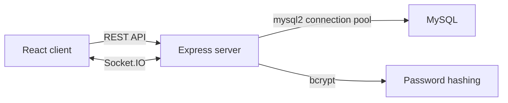

# ChatSphere


A full-stack real-time chat application with persistent storage and real-time messaging.

## Overview

ChatSphere is a real-time chat system that supports:

- User authentication
- Persistent data storage (MySQL)
- Live chat updates (Socket.IO)
- Online user tracking
- Containerized development environment (Docker)

---

## Tech Stack

### Frontend
- React
- Vite
- CSS
- Socket.IO Client

### Backend
- Node.js
- Express
- Socket.IO
- bcrypt
- cookie-parser

### Database
- MySQL 8

### DevOps / Tooling
- Docker
- Docker Compose
- GitHub Actions

---

## Features

- User registration and login
- Password hashing with bcrypt
- Session-based authentication
- Persistent users, sessions, and messages in MySQL
- Real-time messaging with Socket.IO
- Live online user list
- Dockerized multi-service setup
- React frontend with Vite proxy
- Express REST API backend

---

## Architecture



ChatSphere uses REST endpoints for authentication, session checks, initial message loading, and user loading. Socket.IO handles live chat events after a user has joined the chat. Messages are persisted in MySQL, while the online user list is derived from active socket connections.

## API Overview

| Method | Endpoint | Purpose |
|--------|----------|---------|
| `GET` | `/api/session` | Check whether the current browser has a valid session |
| `POST` | `/api/auth/register` | Create a user, hash the password, and start a session |
| `POST` | `/api/auth/login` | Verify credentials and start a session |
| `DELETE` | `/api/session` | Clear the session cookie and delete the stored session |
| `GET` | `/api/messages` | Load persisted chat messages for an authenticated user |
| `GET` | `/api/users` | Load currently connected chat users |

## Real-Time Events

| Event | Direction | Purpose |
|-------|-----------|---------|
| `join-chat` | Client to server | Associate a socket connection with the logged-in user |
| `send-message` | Client to server | Persist a message from the connected user |
| `messages-updated` | Server to clients | Broadcast the latest message list |
| `users-updated` | Server to clients | Broadcast the active user list |
| `chat-error` | Server to client | Report message or server errors |

---

## Project Structure

```bash
chatSphere/
├── client/                  # React + Vite frontend
│   ├── src/
│   │   ├── api/
│   │   ├── components/
│   │   ├── App.jsx
│   │   ├── main.jsx
│   │   └── styles.css
│   ├── Dockerfile
│   ├── package.json
│   └── vite.config.js
├── sql/
│   └── schema.sql           # MySQL schema
├── server/                  # Express + Socket.IO backend
│   ├── index.js             # API routes, socket events, and server startup
│   ├── chats.js             # chat/user DB logic
│   ├── db.js                # MySQL connection with retry
│   ├── sessions.js          # session DB logic
│   └── tests/
│       └── validation.test.js
├── .github/
│   └── workflows/
│       └── ci.yml           # GitHub Actions CI workflow
├── Dockerfile               # backend Dockerfile
├── docker-compose.yml
├── package.json             # backend dependencies
└── README.md
```

# How to Run ChatSphere

This guide explains how to run the ChatSphere application using either Docker (recommended) or local development setup.

---

## Option 1: Run with Docker (Recommended)

### Prerequisites

- Docker Desktop installed
- Docker Desktop is running

---

### 1. Start the application

From the project root directory:

```bash
docker compose up --build
```

---

### 2. Access the application

| Service   | URL                          |
|----------|------------------------------|
| Frontend | http://localhost:5173        |
| Backend  | http://localhost:3000        |

---

### 3. Stop the application

```bash
docker compose down
```

---


## Option 2: Run Locally (Without Docker)

---

### 1. Start MySQL

Make sure MySQL is installed and running.

Create database:

```sql
CREATE DATABASE chat_app;
```

Run schema:

```bash
mysql -u root -p chat_app < sql/schema.sql
```

---

### 2. Create `.env` file

In the project root:

```env
PORT=3000
DB_HOST=localhost
DB_PORT=3306
DB_USER=root
DB_PASSWORD=your_password
DB_NAME=chat_app
```

---

### 3. Start backend

```bash
npm install
npm start
```

---

### 4. Start frontend

```bash
cd client
npm install
npm run dev
```

---

### 5. Access application

| Service   | URL                   |
|----------|------------------------|
| Frontend | http://localhost:5173 |


---

## Common Issues

---

### 1. MySQL not ready (Docker)

If backend logs show connection errors:

```text
ECONNREFUSED
```

This usually means MySQL is still starting.

Solution:
- Wait a few seconds
- Or restart containers

---

---


### 2. Port already in use

If you see port conflicts:

- Change ports in `docker-compose.yml`
- Or stop existing services using that port

---

## Notes

- Docker uses service names for networking (`DB_HOST=db`)
- The Vite proxy targets `http://localhost:3000` by default for local development
- Docker overrides the Vite proxy with `VITE_API_PROXY_TARGET=http://server:3000`
- `.env` is used only in local mode
- Docker uses `environment` in compose instead

---

